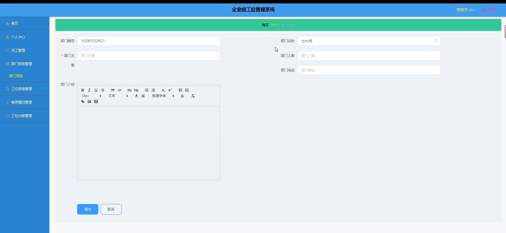

# 基于springboot的企业级工位管理系统

<h4 style='color:red'>联系不到我，就看我的主页 </h4> 
 
#### 介绍

在现代企业的办公环境中，高效合理的工位管理对于提升企业运营效率和员工工作体验至关重要。基于 Spring Boot 开发的企业级工位管理系统应运而生，旨在为企业提供一个便捷、精准、智能化的工位管理解决方案。

#### 技术栈

后端技术栈：Springboot+Mysql+Maven

前端技术栈：Vue+Html+Css+Javascript+ElementUI

开发工具：Idea+Vscode+Navicate

#### 系统功能介绍

（一）管理员角色  
个人中心：管理员可在个人中心查看和修改个人信息，设置个性化的系统操作偏好，如通知方式、界面布局等。  
员工管理：对企业内所有员工的信息进行集中管理，包括员工的基本资料（姓名、工号、部门等）、职位信息、入职时间等。同时支持员工信息的新增、修改、删除和查询操作，便于及时更新员工信息库。  
部门信息管理：全面管理企业的部门架构和相关信息，如部门名称、部门职能、所属楼层等。能够灵活地创建、修改和删除部门，以适应企业组织架构的调整和变化。  
工位信息管理：详细记录每个工位的具体信息，包括工位编号、位置坐标、所属区域、配套设施（如电源插座、网络接口等）等。管理员可以方便地添加、编辑和删除工位信息，确保工位信息的准确性和完整性。  
使用情况管理：实时监控和掌握工位的使用状态，包括已占用、空闲、预定等。通过直观的图表和报表，清晰呈现工位的使用频率、使用时长等数据，为优化工位资源配置提供决策依据。  
工位分配管理：根据员工的需求和企业的规划，合理分配工位资源。支持手动分配和自动分配两种模式，在分配过程中考虑员工的职位、部门、工作性质等因素，确保分配的公平性和合理性。  

（二）员工角色  
个人中心：员工在此可以查看和修改个人资料，如联系方式、紧急联系人等。  
部门信息管理：查看所在部门的详细信息，了解部门的职责和组织架构，方便与同事进行协作和沟通。  
工位分配管理：员工可以提出工位申请或查看自己的工位分配情况。在工位调整时，能够及时了解相关信息并进行相应的操作。  

#### 系统作用

1. - 提升空间利用率  
精确掌握工位的使用情况，避免工位闲置浪费，实现空间资源的最大化利用，降低企业办公成本。  
1. - 优化工作流程  
自动化的工位分配和管理流程，减少了人工干预和繁琐的协调工作，提高了管理效率和工作准确性。  
1. - 增强员工满意度  
为员工提供舒适、合适的工位环境，满足员工的工作需求，有助于提升员工的工作积极性和满意度。  
1. - 支持企业发展  
随着企业的扩张或调整，系统能够灵活适应组织架构和人员的变化，为企业的持续发展提供有力支持。  
1. - 数据驱动决策  
系统提供的丰富数据分析和报表，为企业管理层在办公空间规划、资源配置等方面提供科学依据，促进企业的精细化管理。  

#### 系统功能截图

代码结构

数据库表

登录

员工端个人信息

部门信息管理

管理员端员工管理

部门信息增加

工位信息管理

使用情况管理

工位分配管理

#### 总结

基于 Spring Boot 的企业级工位管理系统通过清晰的角色划分和全面的功能模块，实现了对企业工位资源的高效管理和合理配置。它不仅提升了企业的运营管理水平，还为员工创造了更加舒适和便捷的工作环境，有力地推动了企业的发展和创新。未来，随着企业需求的不断变化和技术的持续进步，该系统将不断演进和完善，以更好地服务于企业的发展战略。

#### 使用说明

创建数据库，执行数据库脚本 修改jdbc数据库连接参数 下载安装maven依赖jar 启动idea中的springboot项目

后台地址
http://localhost:8080/springbooti8ts3/admin/dist/index.html

管理员  abo 密码 abo